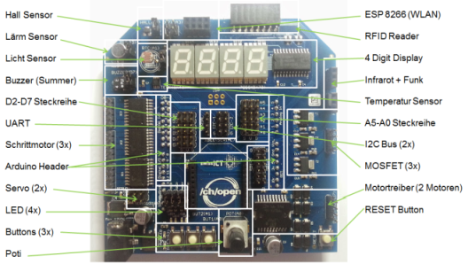
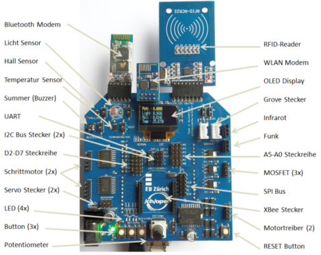
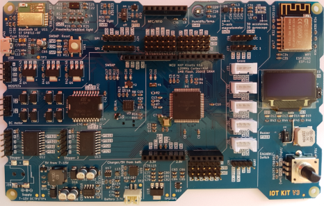

Internet der Dinge Kit
----------------------

| IoTKit V1   | IoTKit V2  | IoTKit V3  |
|  :-------:  | :-------:  | :-------:  |
||||
|[Dokumentation](https://github.com/mc-b/IoTKitV1)|[Dokumentation](https://github.com/mc-b/IoTKitV2)|
|[Dokumentation](https://github.com/mc-b/IoTKitV1)|[Dokumentation](https://github.com/mc-b/IoTKitV3)|

### Kurse:

Kursreihe: "Internet der Dinge" für Implementierer
* [Grundlagen](https://www.eb-zuerich.ch/angebot/internet-der-dinge-grundlagen.html)
* [Aufbau 1 – Komplexe Anwendungen](https://www.eb-zuerich.ch/angebot/internet-der-dinge-aufbau.html)

Internet of Things (IoT) für Informatiker
* [Internet of Things (IoT) im Einsatz](https://www.digicomp.ch/weiterbildung/trainings-zu-platforms-services/platform-as-a-service-paas/internet-of-things-iot/internet-of-things-iot-im-einsatz)
* [Für IT- und Software-Architekten](https://www.digicomp.ch/mastering-digital-change/7-kompetenzfelder-fuer-den-digitalen-wandel/handlungsfeld-it/neue-technologien/internet-of-things-iot-fuer-it-und-softwarearchitekten)

### Referate: 

* 17.05.17: [IT Infrastruktur "on demand"](https://github.com/mc-b/IoTKit/blob/master/Talks/2017-05-17-IT-Architektur_on_demand.pdf)
* 04.05.17: [Big Data mit Open Source](https://github.com/mc-b/IoTKit/blob/master/Talks/2017-05-04-BigData.pdf)
* 03.05.17: [Vom Umgang mit Containern](https://github.com/mc-b/IoTKit/blob/master/Talks/2017-05-03-VomUmgangmitContainern.pdf)
* 05.04.17: [Internet der Dinge](https://github.com/mc-b/IoTKit/blob/master/Talks/2017-04-05-InternetDerDinge.pdf) 
* 15.03.17: [Big Data und KI](https://github.com/mc-b/IoTKit/blob/master/Talks/2017-03-15-BigDataUndKI.pdf) 
* 01.03.17: [Digital Transformation](https://github.com/mc-b/IoTKit/blob/master/Talks/2017-03-01-DigitaleTransformation.pdf)
* 18.09.16: [Internet of Things – was es ist & wie es Leben rettet](https://github.com/mc-b/IoTKit/blob/master/Talks/2016-09-18-MakerFaire-IoTLebenRetten/MakerFaire_IoTLebenRetten.pdf)
* 18.09.16: [Internet of Things – Anwendung im Alltag am Beispiel Smart Kitchen](https://github.com/mc-b/IoTKit/blob/master/Talks/2016-09-18-MakerFaire-IoTKitchenHelper/MakerFaire_IoTKitchenHelper.pdf)
* 29.08.16: [Industrie 4.0: Wie kommunizieren die Systeme?](https://github.com/mc-b/IoTKit/blob/master/Talks/2016-08-29-NormenStandard/2016-08-29-NormenStandards.pdf)
* 03.06.16: [Internet of Things – was es ist & wie es Leben rettet](https://github.com/mc-b/IoTKit/blob/master/Talks/2016-06-03-IoTLebenRetten/Informatiktage_IoTLebenRetten.pdf)
* 03.06.16: [Internet of Things – Anwendung im Alltag am Beispiel Smart Kitchen](https://github.com/mc-b/IoTKit/blob/master/Talks/2016-06-3-IoTKitchenHelper/Informatiktage_IoTKitchenHelper.pdf)
* 30.03.16: [Spielerisch ins Internet der Dinge](https://github.com/mc-b/IoTKit/blob/master/Talks/2016-03-30-Lernstick/Spielerisch%20ins%20Internet%20der%20Dinge%20-%20USB%20Lernstick-Community-Treffen%20vom%2030.pdf)
* 04.03.16: [Internet der Dinge (IoT) Orchestrierung](https://github.com/mc-b/IoTKit/tree/master/Talks/2016-03-04-IoT_Orchestrierung)
* 04.02.16: [ Infrastructure as Code (Docker, Vagrant und Co. im Einsatz)](http://www.ch-open.ch/fileadmin/user_upload/OBL_ZH_04.02.2016_-_Folien.pdf)
* 02.02.16: [Internet der Dinge (IoT) für Integratoren](http://news.digicomp.ch/de/2016/02/03/opentuesday-slides-internet-der-dinge-iot-fur-integratoren/)
* 13.04.15: [Kommunikation zwischen Applikationen im Internet of Things](https://developer.mbed.org/users/marcel1691/notebook/kommunikation-zwischen-applikationen-im-internet-o/)
* 02.04.15: [Prototype to Product for Internet of Things in One Step](http://www.ch-open.ch/fileadmin/user_upload/events/obl/2015/150402_prototype-to-product-iot.pdf)
* 05.02.15: ["Open" Internet der Dinge (IoT) im Zusammenspiel mit Fachanwendungen und Cloudservices](http://www.ch-open.ch/fileadmin/user_upload/events/obl/2015/20150205_OBL_Internet_der_Dinge.pdf)
* 08.05.14: [FabLab Zürich 2.0](http://www.ch-open.ch/fileadmin/user_upload/events/obl/2014/140508_FabLabVersion2.pdf)
* 06.02.14: [Bottom-up Innovation und Open Source Internet of Things](http://www.ch-open.ch/fileadmin/user_upload/events/obl/2014/140206_OpenSourceIoT.pdf)
* 03.10.13: [Raspberry Pi – erste Erfahrungen und Projekte](http://www.ch-open.ch/fileadmin/user_upload/events/obl/2013/131002_RaspberryPi_Erste_Erfahrungen.pdf)
* 02.05.13: [Internet of Things](http://www.ch-open.ch/fileadmin/user_upload/events/obl/2013/130502_Internet_of_Things.pdf)
* 07.02.13: [FabLab Zürich - Open Software meets Open Hardware](http://www.ch-open.ch/fileadmin/user_upload/events/obl/2013/130207_FabLab_Zuerich_OBL.pdf)
* 03.11.11: [MakerBot as an example of Open Source Hardware](http://www.ch-open.ch/events/obl/obl-2011/)

### Workshops:
- 18.09.2016: [Das Internet der Dinge erlebt die Welt](http://dynamo.ch/kurs/das-internet-der-dinge-erfährt-die-welt) (Zürich Mini Maker Faire)
- 17.09.2016: [Das Internet der Dinge bewegt Roboter](http://dynamo.ch/kurs/das-internet-der-dinge-bewegt-roboter) (Zürich Mini Maker Faire)
- 15.09.2016: [CH Open Workshop - Internet der Dinge](http://www.ch-open.ch/wstage0/workshop-tage/2016/ws-16-internet-der-dinge/)
- 04.06.2016: [Das Internet der Dinge erlebt die Welt](https://informatiktage.ch/veranstaltungen/workshop-iot-sensoren/) (Informatiktage 2016)
- 04.06.2016: [Das Internet der Dinge bewegt Roboter](https://informatiktage.ch/veranstaltungen/iot-roboter/) (Informatiktage 2016)
- 02.09.2015: [/ch/open Workshop](https://developer.mbed.org/teams/ch-open-wstage2015/)
- 28.03.2015: [OSS an Schulen](https://developer.mbed.org/users/marcel1691/notebook/oss-an-schulen/)
